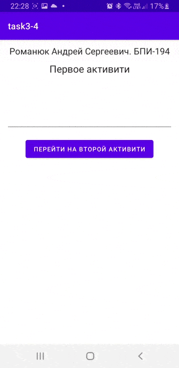
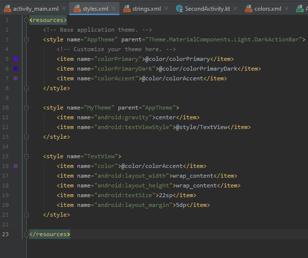

# Домашняя работа № 3-4
## Выполнил: Романюк Андрей, БПИ-194

Задание 3.  Создать приложение, которое состоит из нескольких activities. Первое activity содержит элемент TextView с названием или номером activity, текстовое поле EditText для ввода какой-то информации, кнопку Button с названием "Next" или "Перейти на 2 activity/экран/окно" или просто "2". Помимо этого в 1 activity должен быть TextView с ФИО студента и группой. После нажатия на эту кнопку происходит переход на второе activity, где содержится TextView с названием или номером activity, TextView с надписью что-то вроде "В первом окне вы напечатали:" и под ним - ещё один TextView с содержимым EditText с первого activity, и, разумеется, кнопка "1" или "Вернуться на 1 экран" или "Вернуться к вводу текста", нажав на которую пользователь может перейти обратно к 1 activity. Запустить на эмуляторе и убедиться, что всё работает.

Задание 4. В новом проекте написать приложение, работающее с разными темами/стилями. Сначала создать свой стиль и применить его к какому-нибудь интерфейсному элементу, затем - свою тему, которая применяется ко всем интерфейсным элементам. Приложение при этом должно выглядеть нестандартно. запустить на эмуляторе и убедиться, что всё работает. При возникновении ошибок открыть лог (CatLog) внизу, найти первую красную надпись и породить свою тему от той, которая требуется в этом красном сообщении.

  

 

Примечание:
 > APK находится в папке apk. 
 
 > В качестве стилей использован Material Design.