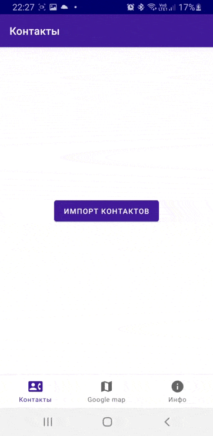

# Домашняя работа № 5-7
## Выполнил: Романюк Андрей, БПИ-194

Задание 5. Создать пользовательский (свой) список. Например, получить доступ в приложении к контактам (Permissions-закладка в AndroidManifest.xml) и скопировать контакты телефона в свой список, который отобразить после запуска приложения. Или создать свой список в виде твиттера (картинка+текст), элементы которого просто статически задать в массиве (как и картинки).

Задание 6.  Создать приложение, содержащее анимированные интерфейсные элементы (например, увеличивающиеся при клике на них кнопки, вращающиеся TextView и т.д.).

Задание 7. Создать приложение, отображающее после запуска карты Google или какие-нибудь другие карты.

  

 

Примечание:
 > APK находится в папке apk.
 
 > Приложение реализовано на архитектуре MVVM. Состоит из одного activity, и 3-х fragments.
 
 > В качестве стилей использован Material Design.